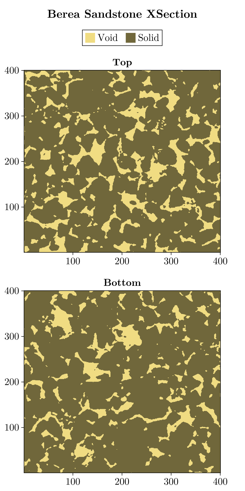
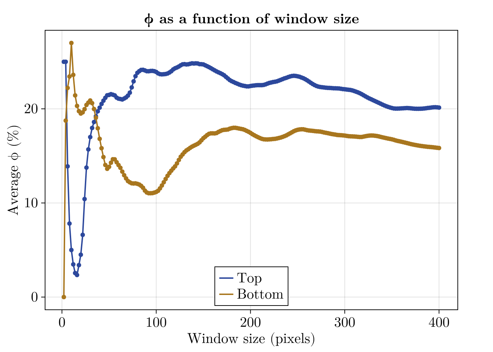
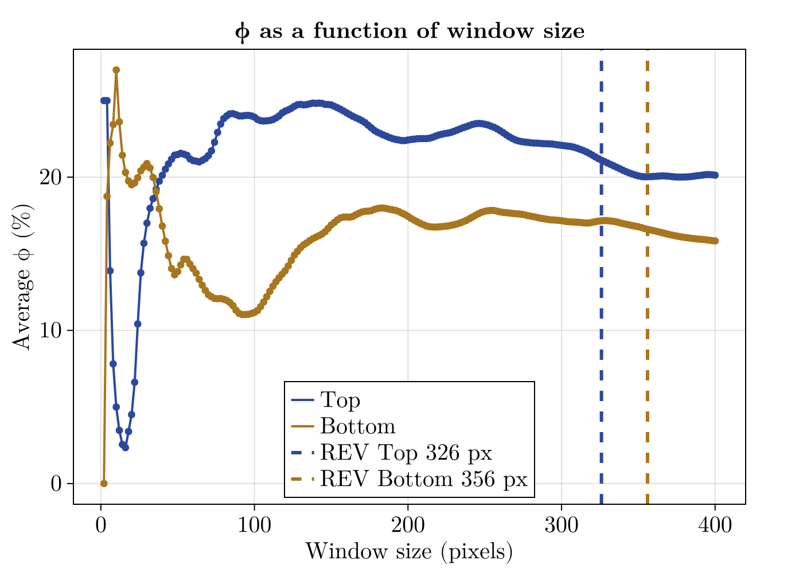

# Homework 1: Porosity and Representative Elementary Volume (REV)

Viet M. Bui,
2026-08-21,
GLY 6826 - Hydrogeologic Modeling

Code source: [gh:vietbuiminh/hydro-modeling/porosity_and_rev.jl](https://github.com/vietbuiminh/hydro-modeling/blob/main/porosity_and_rev.jl)

> This matter because you can view my commits history
---

a) Plot the two micro-CT cross sections.

b) Estimate the porosity of the rock from each cross section. 

The porosity of the rock from each cross section:

$\phi$ Top is estimated to be 0.2013 by taking the division of the total_void / total_bulk. Same goes for $\phi$ Bottom, where the estimation if 0.1584

More calculate can be view inside the Julia file from Github.

c) For each cross section,calculate the average porosity within a square window centered on the image as a function of window size. Plot the results for both cross sections on the same graph.

I made into an Object/Module so it is easier to debug and reuse.

d) Based on the results from part (c), estimate the characteristic length scale of the representative elementary volume (REV) in pixel units.

Note: the REV is the large enough window size which the average $\phi$ properties become approx. stable. Also it is better to let the computer do this by scanning the part (c) curve from the largest to smallest windows and take the first window size after the last tolerance violation.

The tolerance threshold (T) from Yang et al. 2026 suggests 10% is a balance choice. The percentage was selected through sensitivity analysis identified a tolerance threshold ranging between 5% and 15% of the bulk porosity from tight sandstone pore structures. However, their works was estimated with 3D CT where voxel is the unit of volume, here we are using square pixels as the unit of the area and with the justification from the observed curves, I reduced the recommended tolerance threshold to 5% for this 2D case.

After running, REV estimated for Top xcross is 326 px ($\phi ~= 21%$) because it reached a stable flat line in the range of 344 to 400 px, and for Bot xcross is 356 px ($\phi ~= 16%$). However, the Bot curve suggest the REV could be improved by even a larger window size since the curve is still going down and have not yet reached a stable flat line. 

*Reference:*
- Yang, B., Dong, P., Liu, J., Peng, J., & Li, L. (2026). Evaluation of Representative Elementary Volumes for Characterizing Tight Sandstone Microstructure via 3D CT Reconstruction. Water, 18(15), 1805. https://doi.org/10.3390/w18151805