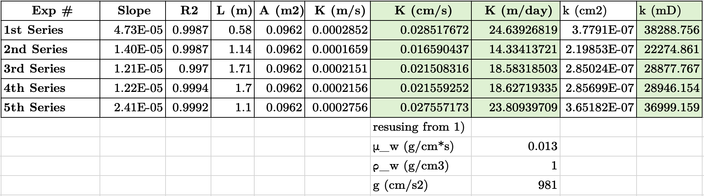

# Homework 2: Darcy's Law, Permeability, and Hydraulic Conductivity

Viet M. Bui,
2026-09-06,
GLY 6826 - Hydrogeologic Modeling

Code source: [gh:vietbuiminh/hydro-modeling/data/darcydata_partial_vb_edits.xlsx](https://github.com/vietbuiminh/hydro-modeling/data/darcydata_partial_vb_edits.xlsx)

> This matter because you can view my commits history
---

**1** A porous medium has an instrisic permeability of **1 darcy**

a) The permeability of the medium in $cm^2$ 

$$
1[d] \approx 9.87 \cdot 10^{-13} [m^2] \approx 9.87 \cdot 10^{-9} [cm^2]
$$

b) Calculate the hydraulic conductivity of the medium for:

- water, with $v_w = 0.013 \frac{cm^2}{s}$

To calculate K we need to find the dynamic viscosity of water $\mu_w$, where density of water $\rho_w=1 [\frac{g}{cm^3}]$

$$
\mu_w = v_w \cdot \rho_w = 0.013 \left[\frac{g}{cm\cdot s}\right]
$$

$$
K_w = \frac{\rho_w g k}{\mu_w} = \frac{1 \cdot 981 \cdot 9.87\cdot 10^{-9}}{0.013} = 0.00074 \left[\frac{cm}{s}\right]
$$

$0.00074 \left[\frac{cm}{s}\right] \cdot 0.01 \left[\frac{m}{cm}\right]\cdot (60*60*24) \left[\frac{s}{day}\right]$
$= 0.63936 \left[\frac{m}{day}\right]$

- a viscous oil, $v_o = 1.8 \frac{cm^2}{s}$

find $\mu_o$ where $\rho_o = 0.956 [\frac{g}{cm^3}]$ referencing Bachaquero (Venezuela) heavy oil from [ZelenTech](https://www.zelentech.co/en/tools/oil-viscosity/) at 15°C 

$$
\mu_o = v_o \cdot \rho_o = 1.8 \cdot 0.956 = 1.7208 \left[\frac{g}{cm\cdot s}\right]
$$

$$
K_o = \frac{\rho_o g k}{\mu_o} = \frac{0.956 \cdot 981 \cdot 9.87\cdot 10^{-9}}{1.7208} \approx 0.00000538 \left[\frac{cm}{s}\right]
$$
$= 0.00464832 \left[\frac{m}{day}\right]$

**2** Darcy column data (`data/darcydata_partial.xls`), five experimental series. For each series, $Q$
was regressed against hydraulic gradient $\Delta h/L$ (change in head over a distance L) where $Q$ and $\Delta h$ is constrained by zero intercept. 

Darcy's law 
$$
Q = -KA\frac{\Delta h}{L}
$$
Given constant parameters:
- $A = 0.0962\ \mathrm{m^2}$.
- $L$ different for each series and provided in the dataset
- $\Delta h = 0 - h$

The slope $= K\cdot A \cdot \frac{1}{L}$, so K is calculated by

$$
K = slope \cdot \frac{L}{A}
$$

To find the permeability (or intrinsic permeability k), I assume the fluid in this experiement is water and reusing the parameter given and found in Part 1 for $\rho_w$, $\mu_w$. 

$$
k = \frac{K \mu_w}{\rho_w g}
$$

All of the values found is highlighted green in the table below.

All five zero-intercept fits are strongly linear ($R^2$), confirming Darcy-regime assumption holds for these flow rates. 

The hydraulic conductivity of the 1st Series and 5th Series (2nd Set-Pressurized) are very high 24.64 m/day and 23.81 m/day, while others are between 14.33 and 18.63 m/day only. 

We can also see that they are also reflected through the permeability of both series in millidarcy, showing how porous the medium of these 2 compared to others by difference up to approximatedly 1.7 times (when comparing 1st Series against 2nd Series). The 1st and 5th series that read high most likely had a different physical sand pack compared to the other runs.
