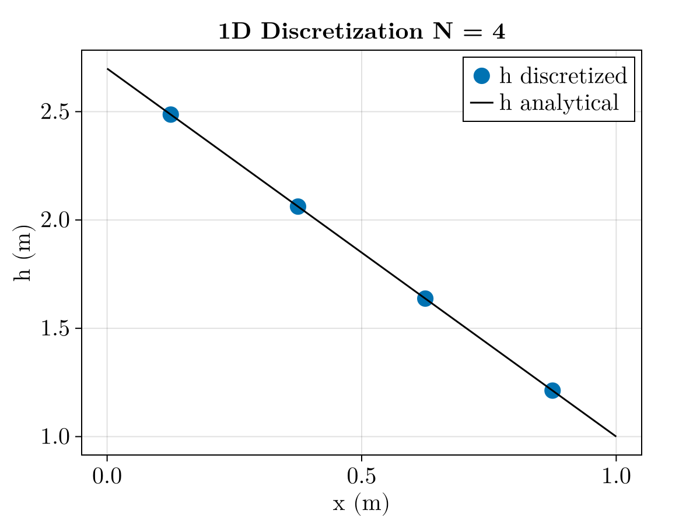
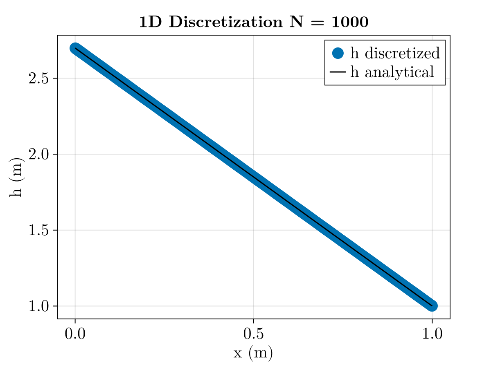

# Homework 3: 1-D Discretization

Viet M. Bui,
2026-09-15,
GLY 6826 - Hydrogeologic Modeling

Code source: [gh:vietbuiminh/hydro-modeling/](https://github.com/vietbuiminh/hydro-modeling/)

> This matter because you can view my commits history
---

Given:
- $k = 1.0\cdot10^{-12} m^2$
- $\rho = 1000 \frac{kg}{m^3}$
- $\mu = 1.0 \cdot 10^{-3} Pa \cdot s$
- $u_{in}$ enters from left boundary $x = 0$
- $h = 1m$ at right boundary $x = 1m$

**1** The hydraulic conductivity

$$
K = \frac{\rho g k}{\mu} \\
= \frac{1000 \cdot 9.81 \cdot 1.0\cdot 10^{-12}}{1.0 \cdot 10^{-3}} \\
= 9.81 \cdot 10^{-6} \ m/s
$$

Starting from the steady-state governing equation (1-D, homogenous)

$$
\nabla \cdot (-K\nabla h) = 0, \\

\frac{d}{dx}\left(-K\frac{dh}{dx}\right) = 0 \\

\implies -K\frac{dh}{dx} = C_1 \\
\implies -Kh(x) = C_1 x+ C_2
$$

*Boundary Conditions:*

- Left boundary: $u_{|x=0} = u_{in} = -K\frac{dh}{dx} = C_1 \\ \therefore C_1 = u_{in}$


- Right boundary: $h_{|x=1m} = 1m \\ -K \cdot 1m = u_{in} \cdot 1m + C_2 \\ \therefore C_2 = -K - u_{in}$

$\implies -Kh = u_{in}x - K - u_{in} = u_{in}(x-1)-K \\ \implies h(x) = - \frac{u_{in}}{K}(x-1) + 1$


$$
u_{in} = 0.1\ \frac{cm}{min} = \frac{0.1 \times 10^{-2}\ m}{60\ s} =1.6666666666666667\cdot 10^{-5}\ m/s
$$

$$
\frac{u_{in}}{K} = \frac{1.6666666666666667\cdot 10^{-5}}{9.81\cdot 10^{-6}} \approx 1.6989
$$

$$
h(x) \approx -1.6989(x-1) + 1 = -1.6989x + 2.6989 \ [m]
$$

$h(0) \approx 2.6989 [m]$

**2** Please refer to Discretize.pdf file for answer writeup

**3** Please refer to 1D-discretize.jl code
Here are the results
```jl
julia> Tmat
4×4 Matrix{Float64}:
  3.924e-5  -3.924e-5   0.0        0.0
 -3.924e-5   7.848e-5  -3.924e-5   0.0
  0.0       -3.924e-5   7.848e-5  -3.924e-5
  0.0        0.0       -3.924e-5   0.00011772

julia> b
4-element Vector{Float64}:
 1.6666666666666667e-5
 0.0
 0.0
 7.848e-5

julia> h
4-element Vector{Float64}:
 2.4865783214407067
 2.061841658171933
 1.63710499490316
 1.2123683316343867
```



The discretized hydraulic head values match the analytical solution, where in problem 1 the linear function intersects x=0 at h approx= 2.6989 m. In the code the h_analytical also give

```jl
julia> h_analytical(0)
2.698946653075094

julia> h_analytical(1)
1.0
```

**4** Problem 4 uses the same code, please visit 1D-discretize.jl and uncomment lines 14

Here is the graph and the result with the comparision of h analytical and h discretize. The graph show that the discretized h match again with analytical h. 

